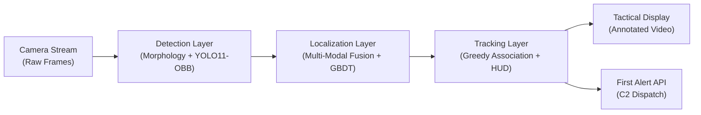
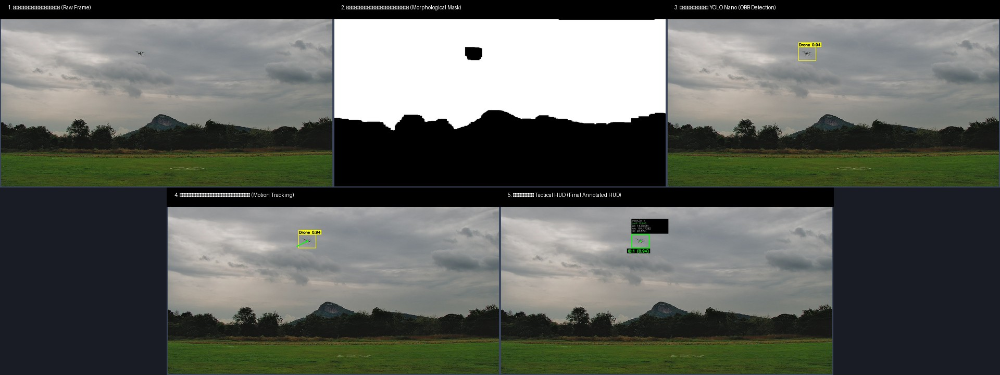

# AI-Based Drone Detection, Localization & Real-Time Tracking System

[](https://www.python.org/)
[](https://github.com/astral-sh/uv)
[](https://github.com/ultralytics/ultralytics)
[](https://www.raspberrypi.com/)
[](tests/)

An end-to-end aerial defense and counter-UAS surveillance system designed for the TESA 2025 Defensive Track. The system integrates classical morphological target extraction with deep learning Oriented Bounding Box (YOLO11-OBB) detection, multi-modal sensor fusion, 3D geodesic regression (GBDT), robust greedy nearest-centroid multi-object tracking, tactical HUD visual telemetry overlays, and automated C2 First Alert dispatch. Engineered to operate efficiently on resource-constrained edge hardware such as the Raspberry Pi 5 without specialized AI accelerators.

---

## Architecture Overview



---

## 5-Stage Processing Pipeline



1. **Stage 1 (Raw Input)**: High-resolution incoming frame stream from the station camera.
2. **Stage 2 (Binarization & Morphology)**: Contrast inversion, dilation with large structuring kernels to bridge rotor blurs, and pinhole closing.
3. **Stage 3 (Detection & Fusion)**: YOLO11-OBB rotated bounding box inference consensus with area-gated morphological candidates.
4. **Stage 4 (Multi-Object Tracking)**: Greedy centroid association with memory gating to maintain ID persistence across visual dropouts.
5. **Stage 5 (HUD & Localization)**: Full tactical HUD overlay rendering 3D coordinates (Latitude, Longitude, Altitude MSL) and confidence metrics.

---

## Quick Start (with `uv`)

All environments and dependencies are managed via [`uv`](https://github.com/astral-sh/uv):

```bash
# 1. Clone repository and initialize virtual environment
uv sync --extra dev

# 2. Review model setup instructions
# (See models/README.md for downloading or training models)

# 3. Run real-time video tracking
uv run python scripts/track_video.py input.mp4 -o output_tracked.mp4

# 4. Run full unit test suite
uv run pytest tests/ -v
```

---

## System Modules

| Module | Core Scripts | Description | Key Performance Metric |
| :--- | :--- | :--- | :--- |
| **1. Detection** | [`scripts/detect_images.py`](scripts/detect_images.py)<br>[`scripts/tune_confidence.py`](scripts/tune_confidence.py) | Classical CV morphological filtering + YOLO11-OBB inference with SAHI support. | **97.7% mAP50** (OBB)<br>**77.08% exact count** |
| **2. Localization** | [`scripts/localize_drones.py`](scripts/localize_drones.py)<br>[`scripts/train_gbdt.py`](scripts/train_gbdt.py) | 20-dimensional spatial feature encoding mapped through 3 independent GBDT regressors. | **3.33 Total Error**<br>(Angle: 3.82°, Alt: 2.14m) |
| **3. Tracking & C2** | [`scripts/track_video.py`](scripts/track_video.py)<br>[`scripts/generate_submission.py`](scripts/generate_submission.py) | Stateful multi-target tracking with tactical HUD overlay and automated First Alert API dispatch. | **0 ID Switches**<br>**100% alert dispatch** |

---

## Performance Summary

- **Detection Precision**: 97.7% mAP50 using YOLO11-OBB for tightly clustered targets.
- **Competition Localization Metric**: 3.33 weighted error ($0.70 \times \text{Angle} + 0.15 \times \text{Height} + 0.15 \times \text{Range}$).
- **Tracking Stability**: Zero identity switches across complex multi-drone aerial trajectories.
- **Edge Deployment Target**: Raspberry Pi 5 (ARM Cortex-A76 CPU, 4GB/8GB RAM, no dedicated GPU accelerator). Training performed on CUDA GPU.

---

## Repository Structure

```
AI-Drone-Detection/
├── README.md
├── pyproject.toml                      # Project config for uv
├── config/
│   └── default.yaml                    # Master parameter configuration
├── defense/
│   ├── __init__.py
│   ├── config.py                       # YAML configuration loader
│   ├── detection/
│   │   ├── __init__.py
│   │   ├── image_processor.py          # Classical morphological CV pipeline
│   │   ├── yolo_detector.py            # YOLO11-OBB inference wrapper
│   │   ├── sahi_detector.py            # Slicing Aided Hyper Inference
│   │   └── confidence_tuner.py         # Automated threshold sweep optimizer
│   ├── localization/
│   │   ├── __init__.py
│   │   ├── feature_encoder.py          # 20-dim spatial feature encoder
│   │   ├── gbdt_regressor.py           # Multi-target GBDT regressor (lat, lon, alt)
│   │   ├── fusion_engine.py            # Multi-modal detection consensus engine
│   │   └── evaluation.py               # Competition evaluation metrics
│   ├── tracking/
│   │   ├── __init__.py
│   │   ├── drone_track.py              # Stateful DroneTrack dataclass
│   │   ├── tracker.py                  # VideoTracker multi-target engine
│   │   ├── hud_renderer.py             # Tactical HUD visualizer overlay
│   │   └── telemetry.py                # First Alert payload builder & dispatcher
│   └── utils/
│       ├── __init__.py
│       ├── logger.py                   # Thread-safe formatted stdout logger
│       ├── video_io.py                 # Video reader/writer helpers
│       ├── image_io.py                 # Image I/O helpers
│       └── geometry.py                 # Geodesic Haversine & bearing math
├── scripts/
│   ├── detect_images.py                # Problem 1: Batch image detection
│   ├── localize_drones.py              # Problem 2: Full localization pipeline
│   ├── track_video.py                  # Problem 3: Video tracking with HUD
│   ├── train_gbdt.py                   # GBDT training script
│   ├── tune_confidence.py              # Confidence threshold optimization
│   ├── prepare_dataset.py              # Video-to-YOLO dataset creator
│   └── generate_submission.py          # Competition CSV submission formatter
├── notebooks/
│   └── train_yolo_obb.ipynb            # YOLO11-OBB fine-tuning notebook
├── models/
│   ├── .gitkeep
│   └── README.md                       # Model weight acquisition guide
├── docs/
│   ├── 01_object_detection.md
│   ├── 02_drone_localization.md
│   ├── 03_drone_tracking.md
│   ├── 04_edge_deployment.md
│   ├── architecture.md
│   └── assets/                         # Visual artifacts and charts
├── tests/
│   ├── test_feature_encoder.py
│   ├── test_fusion_engine.py
│   ├── test_drone_track.py
│   ├── test_gbdt_regressor.py
│   └── test_geometry.py
└── .gitignore
```

---

## License

This project is licensed under the MIT License - see the [LICENSE](LICENSE) file for details.
