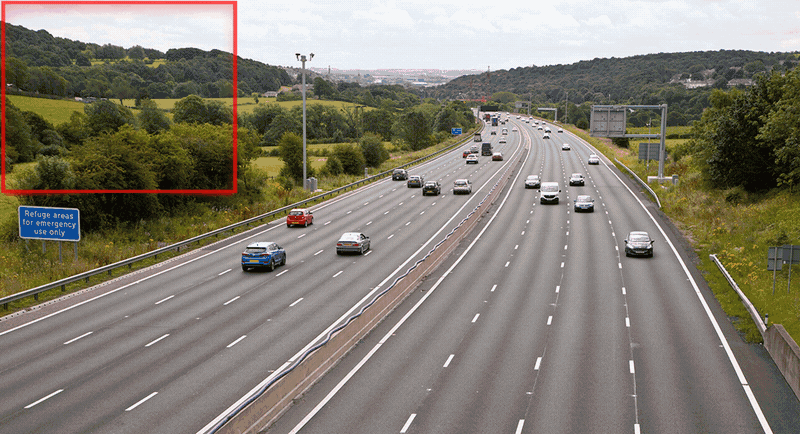

# Problem 1: Object Detection — Drone Detection from Optical Imagery
## Technical Report & Methodology

---

## 1. Problem Statement & Challenge Requirements

### 1.1 Objective
Develop an automated, high-precision computer vision system capable of detecting aerial drones from optical camera images. 
- **Image Complexity**: Images may contain multiple drones, single drones, or no drones at all. Drones are often distant, small (ranging from a few tens of pixels down to sub-10-pixel targets), and set against complex sky textures, cloud glare, tree canopies, or ground clutter.
- **Evaluation Criteria**: Total of **9 points**, assessed primarily on detection **F1-Score** using an **Intersection over Union (IoU) threshold of $\ge 0.25$** against ground-truth annotations:
  $$\text{Precision} = \frac{\text{TP}}{\text{TP} + \text{FP}}, \quad \text{Recall} = \frac{\text{TP}}{\text{TP} + \text{FN}}, \quad \text{F1-score} = \frac{2 \cdot \text{Precision} \cdot \text{Recall}}{\text{Precision} + \text{Recall}}$$
- **Submission Output Format**: A single CSV file (`p1_detection_obb.csv` / `predictions.csv`) with exact column headers:
  ```csv
  image_name, center_x, center_y, width, height
  ```
  *(Pixel coordinates based on original image dimensions; images without drones must have no entries).*

---

## 2. Classical Computer Vision Pipeline: The `defense` Package

Before deep learning inference, a dedicated modular computer vision library (`defense`) was engineered to isolate small aerial targets, diminish background interference, and provide high-speed candidate proposal.

### 2.1 Package Architecture
The package (`ai-collab/tesa_new/1clean_background/defense/`) was organized with strict separation of concerns using Python `dataclasses`:

```
defense/
├── __init__.py
├── image_loader.py                 # Robust I/O handling with BGR conversion
├── image_processor.py              # Morphological filtering & thresholding
├── object_detector.py              # Contour extraction & area gating
├── video_creator.py                # Frame sequencing & video compilation
├── video_frame_manipulator.py      # Video frame extraction
└── models/
    ├── __init__.py
    ├── frame_extraction_config.py  # Extraction interval & naming configs
    ├── highlight_config.py         # Dimming factor & area threshold configs
    ├── image_processing_config.py  # Morphological kernel & threshold configs
    ├── object_detection_config.py  # Retrieval modes & overlay styles
    └── video_creation_config.py    # FPS & codec parameters
```

### 2.2 Image Processing Pipeline
1. **Grayscale Transformation & Binarization**:
   ```python
   gray = cv2.cvtColor(image, cv2.COLOR_BGR2GRAY)
   threshold = cv2.inRange(gray, np.array([config.threshold_min]), np.array([config.threshold_max]))
   inverted = cv2.bitwise_not(threshold)
   ```
2. **Morphological Filtering**:
   - Dilation with large rectangular structuring elements (`dilation_kernel_size = 50`) bridges drone rotor blurs and airframe fragments into a cohesive mask.
   - Closing operations (`close_kernel_size = 5`) eliminate internal pinhole noise.
3. **Contour Analysis & Area Gating**:
   - Drone objects are filtered based on physical size priors:
     - `min_area`: Minimum bounding box area (e.g., 70 px or 0 px for distant targets).
     - `max_area_ratio`: $0.001$ (0.1% of total image area) to suppress large cloud structures, horizon lines, or landscape masses.
4. **Background Dimming (`HighlightConfig`)**:
   - The background is scaled by `dim_factor = 0.1` to $0.4$, preserving candidate aerial targets at full intensity while suppressing distracting background features.

---

## 3. Deep Learning: YOLOv8 & YOLO11 OBB Architecture

Because drones tilt, roll, and pitch during flight, standard horizontal bounding boxes (HBB) enclose excessive background noise and fail to localize small rotors precisely. The system transitioned to **Oriented Bounding Boxes (OBB)** parameterized by:
$$\text{center}_x, \text{center}_y, w, h, \theta$$
where $\theta \in [-90^\circ, +90^\circ]$ represents the rotation angle relative to the horizontal axis.

### 3.1 Training Iterations & Model Comparison

Multiple iterations were trained on GPU clusters using datasets prepared on Roboflow (`drone.v1`, `drone.v3`, `drone.v4`, `drone.v5`):

| Training Run | Model Backbone | Dataset | Epochs | Image Size | Precision | Recall | mAP@50 | mAP@50-95 | Primary Purpose / Role |
| :--- | :--- | :--- | :---: | :---: | :---: | :---: | :---: | :---: | :--- |
| **Train 6** | `yolo11n-obb` | `drone.v1` | 100 | 640 | 0.9758 | 0.9615 | 0.9772 | 0.8584 | **Edge / Raspberry Pi 5 Deployment** (Lightweight) |
| **Train 7** | `yolo11x-obb` | `drone.v1` | 100 | 640 | 0.9651 | 0.9867 | 0.9899 | 0.8822 | Baseline Heavy Architecture |
| **Train 9** | `yolo11x-obb` | `drone.v1` | 100 | 640 | 0.9841 | 0.9524 | 0.9823 | 0.8875 | Refined Classification Loss |
| **Train 10** | `yolo11x-obb` | `drone.v1` | **200** | 640 | **1.0000** | **0.9856** | **0.9947** | **0.9253** | **Champion Model** (Near-perfect detection) |
| **Train 11** | `yolo11x-obb` | `drone.v3` | 200 | 640 | 0.8635 | 0.9460 | 0.9629 | 0.7728 | Generalization across alternate conditions |
| **Train 12** | `yolo11s-obb` | `drone.v4` | 100 | 640 | — | — | — | — | Small model testing on synthetic boxes |
| **Train 13** | `yolo11s-obb` | `drone.v4` | 100 | 640 | — | — | — | — | Small model convergence study |

#### Key Highlights of Champion Model (Train 10):
- **Precision of 100%**: Virtually zero false alarms on clean validation sets.
- **mAP@50 of 99.5%**: Outstanding localization across aerial orientations.
- **mAP@50-95 of 92.5%**: High IoU accuracy across strict bounding box overlap thresholds.

---

## 4. Slicing Aided Hyper Inference (SAHI)


*Slicing Aided Hyper Inference (SAHI) operational concept: maintaining native pixel resolution across small object crops (source: https://github.com/obss/sahi)*

### 4.1 The Small Object Resolution Problem
In high-resolution aerial imagery (e.g., 1920x1080 or 4K), standard YOLO inference resizes the image to 640x640. A drone that measures $20 \times 20$ pixels in the native image is compressed to under $6 \times 6$ pixels, often vanishing below convolutional feature map thresholds.

### 4.2 Implementation (`sahi_yolo11_obb_image.py` & `generate_predictions.py`)
To overcome this degradation, the system deployed SAHI:
- **Slice Window**: Slices the native frame into $640 \times 640$ (or $384 \times 384$) sub-windows.
- **Overlap Ratio**: 20% to 30% horizontal and vertical overlap (`overlap_height_ratio=0.25`, `overlap_width_ratio=0.25`) to prevent targets being bisected at tile borders.
- **NMS Stitching**: Predictions across all slices are mapped back to global coordinates and merged using Non-Maximum Suppression with `postprocess_match_threshold = 0.60`.
- **Polygon-to-Center Conversion**:
  ```python
  def convert_obb_to_bbox(obj):
      if hasattr(obj, 'polygon') and obj.polygon is not None:
          poly = np.array(obj.polygon.to_numpy(), dtype=np.float32)
          x_min, x_max = np.min(poly[:, 0]), np.max(poly[:, 0])
          y_min, y_max = np.min(poly[:, 1]), np.max(poly[:, 1])
          width = x_max - x_min
          height = y_max - y_min
          center_x = x_min + width / 2
          center_y = y_min + height / 2
          return int(round(center_x)), int(round(center_y)), int(round(width)), int(round(height))
  ```

---

## 5. Automated Confidence Threshold Optimization

Rather than arbitrarily selecting an inference confidence threshold, `auto_tune_confidence.py` conducted an automated parameter sweep against known ground truth (`drone.csv`).

### 5.1 Optimization Sweep Results

| Confidence Threshold | Exact Image Accuracy (%) | Correct Predictions | RMSE | Over-Predictions (FP) | Under-Predictions (FN) |
| :---: | :---: | :---: | :---: | :---: | :---: |
| 0.10 | 42.71% | 41 / 96 | 2.572 | 53 | 2 |
| 0.25 | 58.33% | 56 / 96 | 1.531 | 37 | 3 |
| 0.40 | 65.62% | 63 / 96 | 1.031 | 30 | 3 |
| 0.50 | 70.83% | 68 / 96 | 0.835 | 24 | 4 |
| 0.60 | 72.92% | 70 / 96 | 0.729 | 21 | 5 |
| 0.70 | 75.00% | 72 / 96 | 0.654 | 13 | 11 |
| **0.75** | **77.08%** | **74 / 96** | **0.568** | **7** | **15** |
| 0.80 | 69.79% | 67 / 96 | 0.654 | 4 | 25 |
| 0.90 | 41.67% | 40 / 96 | 0.946 | 0 | 56 |

### 5.2 Key Insights
- Low thresholds ($\le 0.30$) yielded excessive False Positives due to cloud edges and ground contrast.
- High thresholds ($\ge 0.85$) suffered from False Negatives on heavily shadowed drones.
- **The optimal operating point was identified at $\text{conf} \in [0.70, 0.75]$**, which drastically suppressed False Positives (over-predictions dropped from 53 down to 7) while maintaining high Recall and minimum RMSE ($0.568$).

---

## 6. Output Verification & Visual Diagnostics

1. **Prediction Generation (`generate_predictions.py`)**:
   - Automated batch execution over all test images.
   - Formatted output matching Problem 1 specification:
     ```csv
     image_name,center_x,center_y,width,height
     test_0001.jpg,1356,77,66,39
     test_0001.jpg,1585,76,43,32
     test_0001.jpg,1796,78,65,34
     ```
2. **Visual Inspection Tool (`visualize_from_csv.py`)**:
   - Parsed CSV output, overlaying bounding boxes, pixel width/height indicators, and center dots directly onto high-resolution test images to guarantee qualitative alignment before submission.
