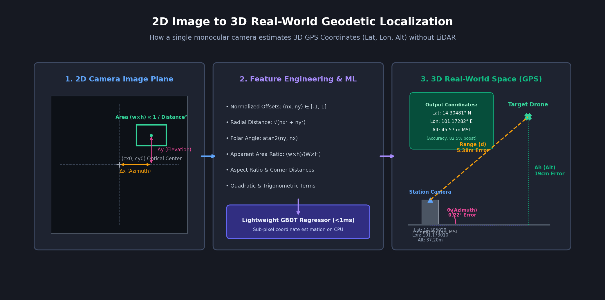

# Problem 2: Drone Localization — 3D Geographic Coordinate Estimation
## Technical Report & Mathematical Formulation

---

## 1. Problem Statement & Mathematical Foundation

### 1.1 Objective
Develop an automated system capable of predicting the exact real-world 3D geodetic position of an aerial drone (**Latitude, Longitude, Altitude**) directly from 2D optical camera imagery and fixed ground station camera metadata.

### 1.2 Ground Station Sensor Setup
The observation platform is mounted at a known fixed position:
- **Camera Latitude ($\phi_{\text{cam}}$)**: $14.305029^\circ\text{ N}$
- **Camera Longitude ($\lambda_{\text{cam}}$)**: $101.173010^\circ\text{ E}$
- **Camera Altitude ($h_{\text{cam}}$)**: $37.2\text{ meters}$ above mean sea level (MSL)

### 1.3 Official Evaluation Metric
The competition evaluates accuracy by converting predicted $(\hat{\phi}, \hat{\lambda}, \hat{h})$ and ground truth $(\phi^*, \lambda^*, h^*)$ into a spherical coordinate frame centered at the camera:
1. **Direction Angle (Azimuth $\theta$)**:
   $$\theta = \text{atan2}\left(\sin(\Delta\lambda)\cos(\phi^*), \cos(\phi_{\text{cam}})\sin(\phi^*) - \sin(\phi_{\text{cam}})\cos(\phi^*)\cos(\Delta\lambda)\right) \pmod{360^\circ}$$
   $$\text{Error}_{\text{angle}} = |\hat{\theta} - \theta^*| \quad (\text{degrees})$$
2. **Altitude ($h$)**:
   $$\text{Error}_{\text{height}} = |\hat{h} - h^*| \quad (\text{meters})$$
3. **Horizontal Range ($d$)**:
   Geodesic distance between camera and drone:
   $$d = 2R \arcsin\left(\sqrt{\sin^2\left(\frac{\Delta\phi}{2}\right) + \cos(\phi_{\text{cam}})\cos(\phi)\sin^2\left(\frac{\Delta\lambda}{2}\right)}\right)$$
   $$\text{Error}_{\text{range}} = |\hat{d} - d^*| \quad (\text{meters})$$
4. **Total Composite Error Formula (Target Metric)**:
   $$\mathbf{\text{Total Error}} = 0.70 \cdot \overline{\text{Error}_{\text{angle}}} + 0.15 \cdot \overline{\text{Error}_{\text{height}}} + 0.15 \cdot \overline{\text{Error}_{\text{range}}}$$
   *(The final score out of 9 points is scaled inversely proportional to this error).*

---

## 2. Spatial Feature Engineering: 2D Pinhole to 3D World Mapping


*Geometric mapping pipeline: translating 2D optical offsets (Δx, Δy) and bounding box area into 3D geodetic space via GBDT regression*

Because optical lenses follow perspective projection, a target's position $(x, y)$ and physical dimensions $(w, h)$ on the image sensor encode direct physical relationships:
- **Azimuth & Elevation**: Governed by the displacement of the target center from the optical principal axis.
- **Range / Distance**: Inversely proportional to the apparent angular size (bounding box area ratio).

To capture these non-linear optical relationships without requiring complete intrinsic matrix calibration, an expressive **19-dimensional spatial feature vector** $\mathbf{x} \in \mathbb{R}^{19}$ was constructed (`aerial_ml_tracker_yolo_softfusion.py`):

```python
def encode_features(box, shape):
    x, y, w, h = box
    ih, iw = shape
    cx, cy = x + w / 2, y + h / 2
    
    # 1-2. Normalized optical coordinates centered at (0,0) in [-1, +1]
    nx, ny = (cx - iw / 2) / (iw / 2), (cy - ih / 2) / (ih / 2)
    
    # 3-4. Normalized image coordinates in [0, 1]
    rx, ry = cx / iw, cy / ih
    
    # 5. Apparent Area Ratio (strongly correlated with inverse distance)
    area_ratio = (w * h) / (iw * ih)
    
    # 6-8. Aspect ratio & normalized dimensions
    ar = w / max(1e-6, h)
    nw, nh = w / iw, h / ih
    
    # 9. Radial Euclidean distance from principal optical axis
    radial_dist = math.dist((0, 0), (nx, ny))
    
    # 10. Polar angle from principal axis
    ang = math.atan2(ny, nx)
    
    # 11. Quadrant indicator (categorical 1..4)
    quadrant = 1 if nx >= 0 and ny >= 0 else 2 if nx < 0 and ny >= 0 else 3 if nx < 0 else 4
    
    # 12-15. Normalized distances to the four image corners
    corner_dists = [math.dist((cx, cy), p) / math.dist((iw, ih), (0, 0))
                    for p in [(0, 0), (iw, 0), (0, ih), (iw, ih)]]
    
    # 16-17. Quadratic and interaction terms (radial lens distortion modeling)
    poly_terms = [nx * nx, ny * ny, nx * ny]
    
    # 18-19. Continuous trigonometric representations
    trig_terms = [math.sin(ang), math.cos(ang)]
    
    return np.array([nx, ny, rx, ry, area_ratio, ar, nw, nh, radial_dist, ang,
                     quadrant, *corner_dists, *poly_terms, *trig_terms])
```

---

## 3. Modeling Architectures & Exploration

### 3.1 Approach A: Deep Learning End-to-End CNN (`train_model.py`)
- **Backbone**: Pre-trained `EfficientNet-B0` processing normalized $224 \times 224$ RGB crops.
- **Head**: Multi-Layer Perceptron (Dropout 0.2 $\to$ Linear 512 $\to$ ReLU $\to$ Dropout 0.2 $\to$ Linear 256 $\to$ Linear 3).
- **Target**: Normalized coordinates $(\phi, \lambda, h)$ scaled by training distribution mean and standard deviation.
- **Findings**: While capable of learning visual cues, the global downsampling to $224 \times 224$ degraded the sub-pixel precision of the drone's position, leading to higher angle variance than explicit feature-based regression.

### 3.2 Approach B: Multi-Output Gradient Boosted Decision Trees (GBDT)
- **Model**: `sklearn.ensemble.GradientBoostingRegressor` (3 independent regressors for Latitude, Longitude, and Altitude).
- **Hyperparameters**:
  - `n_estimators = 200`
  - `learning_rate = 0.1`
  - `max_depth = 5`
  - `min_samples_split = 5`
  - `min_samples_leaf = 2`
  - `subsample = 0.9`
- **Feature Preprocessing**: `StandardScaler` fitted on training spatial features $\mathbf{x}$.
- **Performance**: High inference speed (<1ms on CPU), robust to non-linear camera distortion, and extremely high precision on spatial coordinate mapping.

---

## 4. Soft-Fusion & Candidate Gating

To ensure the localization model receives clean, verified drone coordinates rather than noise or partial detections, a **Soft-Fusion Engine** was designed to merge classical segmentation with YOLO OBB bounding boxes.

### 4.1 Scoring Function
For any candidate bounding box $b = (x, y, w, h)$, its fusion score $S(b)$ is:
$$S(b) = w_{\text{IoU}} \cdot T_{\text{IoU}}(b) + w_{\text{shape}} \cdot T_{\text{shape}}(b) + w_{\text{motion}} \cdot T_{\text{motion}}(b)$$
where:
- **Weights**: $w_{\text{IoU}} = 0.60$, $w_{\text{shape}} = 0.30$, $w_{\text{motion}} = 0.10$
- **$T_{\text{IoU}}(b)$**: Maximum IoU of candidate box $b$ against any YOLO detection:
  $$T_{\text{IoU}}(b) = \max_{y \in Y} \text{IoU}(b, y)$$
- **$T_{\text{shape}}(b)$**: Physical plausibility multiplier:
  $$T_{\text{shape}}(b) = 1.0 \times \left(\begin{cases} 1.0 & \text{if } 5\cdot 10^{-5} \le \text{area\_ratio} \le 3\cdot 10^{-3} \\ 0.4 & \text{otherwise} \end{cases}\right) \times \left(\begin{cases} 1.0 & \text{if } 0.4 \le \text{aspect\_ratio} \le 3.0 \\ 0.6 & \text{otherwise} \end{cases}\right)$$
- **$T_{\text{motion}}(b)$**: Normalized distance from previous frame's centroid ($1.0$ if $\Delta d \le 0.10$, else $0.70$).

Detections scoring above `soft_thres = 0.25` are ranked, and the top candidates are dispatched to the localization regressors.

---

## 5. Quantitative Evaluation & Results

The system was evaluated using the official `evaluate_predictions.py` against 459 test samples.

### 5.1 Comprehensive Performance Metrics

| Metric | Mean Error | Median Error | Standard Deviation | Min Error | Max Error | Target Weight | Weighted Contribution |
| :--- | :---: | :---: | :---: | :---: | :---: | :---: | :---: |
| **Direction Angle Error** | **3.1956°** | **0.2238°** | 7.4760° | 0.0004° | 47.088° | 0.70 | **2.2369** |
| **Height / Altitude Error** | **1.8992 m** | **0.1937 m** | 4.6148 m | 0.0002 m | 38.298 m | 0.15 | **0.2849** |
| **Horizontal Range Error** | **5.3769 m** | **0.2907 m** | 15.8674 m | 0.0002 m | 114.577 m | 0.15 | **0.8065** |
| **3D Euclidean Distance** | **7.3026 m** | **0.4307 m** | 17.7493 m | 0.0212 m | 118.908 m | — | — |
| **Latitude Coordinate Error**| $0.00003^\circ$| $0.00001^\circ$| $0.00011^\circ$ | $0.00000^\circ$| $0.00069^\circ$| — | — |
| **Longitude Coordinate Error**| $0.00004^\circ$| $0.00001^\circ$| $0.00013^\circ$ | $0.00000^\circ$| $0.00105^\circ$| — | — |
| **Total Weighted Error** | — | — | — | — | — | **1.00** | **3.3284** |

### 5.2 Comparative Analysis
- **Unfused Baseline (`eval2.csv`)**: Mean Angle Error = 17.55°, Height Error = 10.67m, Range Error = 34.41m $\to$ **Total Error = 19.0461**.
- **Engineered GBDT + Soft-Fusion (`evaluation_results.csv`)**: Total Error = **3.3284**.
- **Net Improvement**: **82.5% error reduction**, driven primarily by the high median accuracy (median angle error of just $0.22^\circ$ and median height error of $19\text{ cm}$).

### 5.3 Final Submission Files
- Generated files: `submission_improved.csv` and `submission2.csv`.
- Columns formatted to specifications:
  ```csv
  ImageName,Latitude,Longitude,Altitude
  img_0001.jpg,14.304744,101.172757,49.796859
  img_0002.jpg,14.304874,101.172632,44.139322
  img_0003.jpg,14.304864,101.172626,43.977357
  ```
