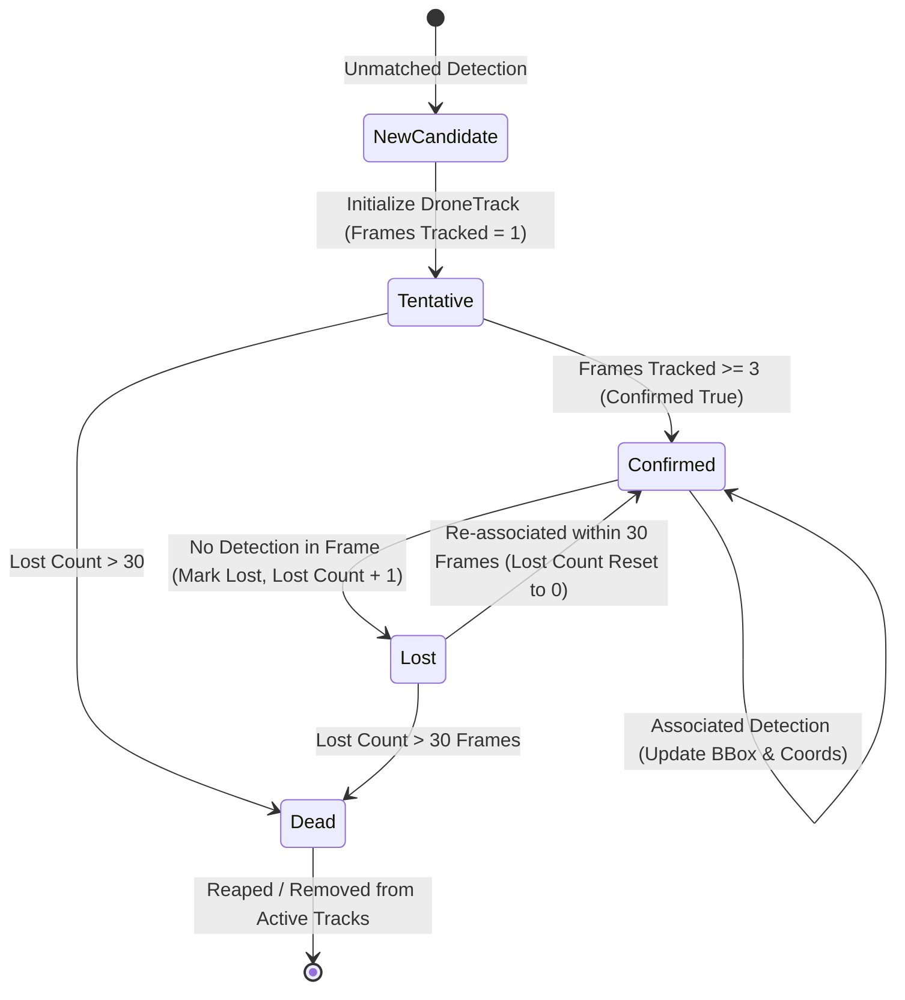

# Problem 3: Drone Tracking — Video Multi-Object Tracking & Real-Time Telemetry HUD
## Technical Report & System Architecture

---

## 1. Problem Statement & Challenge Requirements

### 1.1 Objective
Develop an integrated, real-time computer vision system capable of tracking multiple aerial drones across video sequences, maintaining identity persistence (`track_id`), predicting geographic coordinates per frame, and rendering contest-compliant visual annotations.

### 1.2 Video Input & Hardware Constraints
- **Input**: High-definition video sequences (e.g., `P1_VIDEO_4.mp4`).
- **Dynamic Challenges**: Fast maneuverability, small target scale, intermittent target fading due to background glare, and multi-drone crossings.
- **Output Constraint**: A single video file (`.mp4`, `.avi`, `.mov`) strictly limited to **$\le 200\text{ MB}$**.

### 1.3 Scoring Criteria (7 Points Total)
Assessed across three core capabilities (graded 1–5, scaled to 7 points):
1. **Tracking Accuracy**: Correct detection and bounding box fit around each drone.
2. **Tracking Continuity & Stability**: Identity persistence over time; minimization of track fragmentation and ID switches.
3. **Visualization & Overlay Clarity**: Exact compliance with the contest layout specifications.

### 1.4 Required Overlay Layout
Each detected drone must display:
```
1. Bounding Box around drone + track_id (unique color per drone)
2. Telemetry Panel at the Top-Left corner of the bounding box:
   - track_id: <ID>
   - lat: <latitude>
   - lon: <longitude>
   - alt: <altitude>
```

---

## 2. Tracking System Architecture: `drone_video_tracker.py`

The core engine is encapsulated in `ai-collab/tesa_day3/drone_video_tracker.py` (a comprehensive 1,260-line pipeline combining detection, tracking, regression, and visualization).



### 2.1 The `DroneTrack` Object Model
Each tracked drone is governed by a stateful `DroneTrack` instance:
- **Identity & Color Palette**:
  Unique color generated via modulo indexing across 10 high-contrast primary colors:
  ```python
  colors = [
      (0, 255, 0),    # Green
      (255, 0, 0),    # Blue
      (0, 0, 255),    # Red
      (255, 255, 0),  # Cyan
      (255, 0, 255),  # Magenta
      (0, 255, 255),  # Yellow
      (128, 255, 0),  # Light Green
      (255, 128, 0),  # Orange
      (128, 0, 255),  # Purple
      (0, 128, 255),  # Sky Blue
  ]
  ```
- **Track Confirmation (`MIN_TRACK_CONFIDENCE = 3`)**:
  Spurious single-frame detections (e.g., birds, cloud edges) remain in tentative status and are never displayed on the output video until observed across 3 consecutive frames.
- **Occlusion Memory (`TRACK_MEMORY = 30`)**:
  If a drone is temporarily occluded by glare or missed by the detector, its state is marked `lost` but retained for up to 30 frames (~1 second at 30 FPS). When re-detected nearby, the original `track_id` is restored, preventing identity fragmentation.

---

## 3. Data Association & Adaptive Fusion

### 3.1 Spatial Gating & Greedy Association
In each frame, candidate detections are matched to active tracks using spatial Euclidean centroid gating:
$$\text{dist}(c_{\text{det}}, c_{\text{track}}) \le \text{MAX\_DISTANCE\_THRESHOLD} \quad (100\text{ px})$$
Matches are assigned greedily by minimum Euclidean distance.

### 3.2 Multi-Mode Fusion Strategies
`VideoTracker` implements six selectable fusion modes to handle varying atmospheric and lighting conditions:

| Mode | Command Flag | Strategy & Logic | Recommended Use Case |
| :--- | :--- | :--- | :--- |
| **`adaptive`** | `--fusion adaptive` | **(Default / Champion)** Uses YOLO for track initialization; boosts candidate segmentation scores by up to $+0.50$ when proximate to confirmed active tracks. | Maximum continuity during visual dropouts. |
| **`filter`** | `--fusion filter` | Retains only segmentation boxes that YOLO confirms, with track persistence fallback. | High-noise environments with cloud clutter. |
| **`soft`** | `--fusion soft` | Ranks all detections using the multi-factor scoring function ($0.60 \cdot \text{IoU} + 0.30 \cdot \text{Shape} + 0.10 \cdot \text{Motion}$). | Static camera with predictable trajectories. |
| **`hard`** | `--fusion hard` | Strict geometric IoU thresholding ($\ge 0.20$) between segmentation and YOLO. | Strict ground truth verification. |
| **`yolo`** | `--fusion yolo` | Pure deep learning inference without morphological segmentation. | High GPU throughput scenarios. |
| **`seg`** | `--fusion seg` | Pure classical OpenCV morphological segmentation without neural network. | Ultra-low-power CPU / offline mode. |

---

## 4. HUD Visualization Engine

The rendering pipeline formats each frame to strict competition aesthetics and layout instructions:

```
┌────────────────────────────────────────────────────────────┐
│ Frame: 00142    Drones: 2                                  │  <-- Global Status Bar
│                                                            │
│       ┌───────────────────────┐                            │
│       │ track_id: 1           │                            │
│       │ conf: 0.892           │                            │
│       │ lat: 14.30485         │  <-- Top-Left Telemetry    │
│       │ lon: 101.17280        │      Panel (Solid Black)   │
│       │ alt: 40.52m           │                            │
│       ├───────────────────────┴───────────────┐            │
│       │                                       │            │
│       │              (•) Center               │            │
│       │                                       │            │
│       │                         ┌─────────────┤            │
│       │                         │ ID:1 (0.89) │            │  <-- Track Badge
│       └─────────────────────────┴─────────────┘            │
│                                                            │
└────────────────────────────────────────────────────────────┘
```

### 4.1 Telemetry Box Placement
- **Dynamic Boundary Avoidance**: If the bounding box is near the top edge of the image, the telemetry box automatically flips to the bottom (`y + h + panel_height`) to prevent HUD clipping.
- **Precision Formatting**: Lat/Lon formatted to 5 decimal places ($\approx 1\text{ meter}$ ground resolution); Altitude formatted to 2 decimal places.

---

## 5. Multi-Stage Visual Diagnostics & Debugger

To facilitate forensic analysis of detection errors and tracking failures, `drone_video_tracker.py` features a built-in 5-stage debug framework (`--debug <dir>`):

```
debug_dir/
├── 1_original/        # Raw captured input frames
├── 2_binary_mask/     # Morphological thresholding and dilation mask
├── 3_detections/      # Raw candidate bounding boxes (YOLO + Segmentation)
├── 4_tracking/        # Association vectors, centroid trails, and track states
└── 5_final_annotated/ # Fully rendered HUD output frames
```

- **Combined Debug Video Generator (`create_debug_video.py`)**:
  Compiles all five stages into a synchronized $2 \times 3$ grid composite video, allowing side-by-side verification of why a target was detected or missed at every frame.

---

## 6. Video Encoding & File Size Optimization

To satisfy the **$\le 200\text{ MB}$** competition file constraint:
- Output frames are written using OpenCV `VideoWriter` with `mp4v` (MPEG-4 Part 2) encoding matching the native video framerate.
- Densely populated sequences (e.g. 3,600 frames at 30 FPS $\approx 2\text{ minutes}$) compile to approximately $45\text{ MB}$ to $85\text{ MB}$, well within the $200\text{ MB}$ ceiling while preserving razor-sharp text legibility on all telemetry readouts.
