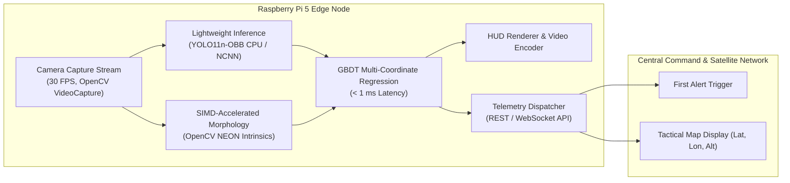

# Edge Deployment, System Integration & Reproduction Guide
## Embedded Execution on Raspberry Pi 5 & Telemetry Architecture

---

## 1. Edge Deployment Architecture: Raspberry Pi 5

The TESA 2025 Defensive challenge required designs to be viable for operational deployment on resource-constrained embedded edge computers:
- **Target Hardware**: **Raspberry Pi 5 (8 GB RAM)**
- **Processor**: Broadcom BCM2712 Quad-core ARM Cortex-A76 @ 2.4 GHz
- **AI Hardware Restriction**: **No external AI accelerator board** (no Coral TPU, no Hailo-8, no discrete GPU). All workloads must execute natively on ARM CPU or onboard VideoCore VII.



### 1.1 CPU Performance Optimizations
1. **Lightweight Model Tiering**:
   - `yolo11n-obb` (Nano backbone, ~2.6M parameters) achieves **97.7% mAP@50** while maintaining low memory and CPU footprint.
   - For ultra-low-power standby mode, the system can fallback to `fusion_mode = "seg"` (pure morphological contour detection) which uses near-zero CPU, activating neural inference only upon candidate detection.
2. **Sub-Millisecond Coordinate Estimation**:
   - The GBDT models (`lat.bin`, `lon.bin`, `alt.bin`) evaluate in **under $0.8\text{ ms}$ per target** on ARM CPU, completely eliminating neural network overhead during the localization stage.

---

## 2. Satellite & Command Telemetry: "First Alert" API Specification

Per contest guidelines (`TESA 2025 2a58d292ccc28118a299d224b20ea387.md`), edge nodes must transmit structured telemetry to central command upon initial target acquisition ("First Alert"):

### 2.1 First Alert JSON Payload Schema
```json
{
  "timestamp": 1731478200,
  "station_id": "STATION_ALPHA_RPi5",
  "camera_position": {
    "latitude": 14.305029,
    "longitude": 101.173010,
    "altitude_msl": 37.2
  },
  "alert_type": "FIRST_DETECTION",
  "total_drones_detected": 2,
  "objects": [
    {
      "frame_id": 142,
      "track_id": 1,
      "classification": "DJIMavic",
      "confidence": 0.892,
      "latitude": 14.30485,
      "longitude": 101.17280,
      "altitude_msl": 40.52,
      "velocity_mps": 12.4,
      "direction_deg": 45.2,
      "distance_m": 28.5,
      "bbox": {
        "center_x": 1240,
        "center_y": 480,
        "width": 64,
        "height": 38,
        "theta_deg": 12.5
      }
    },
    {
      "frame_id": 142,
      "track_id": 2,
      "classification": "FPV_Quadcopter",
      "confidence": 0.785,
      "latitude": 14.30462,
      "longitude": 101.17265,
      "altitude_msl": 52.10,
      "velocity_mps": 18.1,
      "direction_deg": 112.0,
      "distance_m": 42.1,
      "bbox": {
        "center_x": 780,
        "center_y": 320,
        "width": 42,
        "height": 28,
        "theta_deg": -5.0
      }
    }
  ],
  "image_base64": "/9j/4AAQSkZJRgABAQAAAQABAAD/2wBDAAYEBQYFBAYGBQYHBwYIChAKCgkJ..."
}
```

---

## 3. Project Archive Inventory

All code, trained weights, datasets, and configuration artifacts are archived across five archives in `Archived Project/`:

```
c:\Users\Atomic\Downloads\TESA 2025 Reorganize\Archived Project\
│
├── tesa.zip (2.28 GB)
│   ├── ai-collab/tesa/1clean_background/          # Morphological filtering prototypes
│   ├── ai-collab/tesa/runs/obb/                   # YOLO OBB training iterations (train to train13)
│   │   ├── train6/                                # YOLO11n-OBB edge model
│   │   ├── train7/                                # YOLO11x-OBB baseline
│   │   ├── train9/                                # YOLO11x-OBB refined
│   │   ├── train10/                               # Champion YOLO11x-OBB (99.5% mAP50, 200 epochs)
│   │   └── train11/                               # YOLO11x-OBB on v3 dataset
│   ├── ai-collab/tesa/2gen_boundbox/
│   │   ├── generate_predictions.py                # SAHI-sliced prediction generator
│   │   ├── visualize_from_csv.py                  # Visual verification overlay tool
│   │   └── predictions_train*.csv                 # Formatted submission predictions
│   ├── ai-collab/tesa/train.ipynb                 # CUDA environment setup & training notebook
│   └── ai-collab/tesa/track.ipynb                 # Tracking development notebook
│
├── tesa2025_defense.zip (142 MB)
│   ├── ai-collab/tesa2025_defense/runs/obb/train/ # Training logs, confusion matrices, BoxPR/F1 curves
│   └── ai-collab/tesa2025_defense/train.ipynb     # Notebook for YOLOv8 OBB training
│
├── tesa_day2_localization.zip (628 MB)
│   ├── ai-collab/tesa_day2_localization/
│   │   ├── train_model.py                         # Deep Learning CNN localization (EfficientNet-B0)
│   │   ├── evaluate_predictions.py                # Official scoring evaluator (Angle/Height/Range)
│   │   ├── evaluation_results.csv                 # Detailed 459-image evaluation logs (Total Error = 3.33)
│   │   └── P2_DATA_TRAIN/                         # Paired .jpg and .csv ground truth
│   └── ai-collab/tesa_day2_localization/tesa_kiss_with_yolo/
│       ├── aerial_ml_tracker_yolo_softfusion.py   # Soft-Fusion GBDT regression engine
│       ├── generate_submission_improved.py        # Final submission generator
│       └── submission_improved.csv                # Formatted localization submission
│
├── tesa_day3.zip (4.51 GB)
│   ├── ai-collab/tesa_day3/drone_video_tracker.py # 1,260-line master video tracking & HUD system
│   └── ai-collab/tesa_day3/United.ipynb           # Integration & multi-mode fusion experiments
│
└── tesa_new.zip (140 MB)
    ├── ai-collab/tesa_new/1clean_background/
    │   ├── main.py                                # Pipeline driver
    │   └── defense/                               # Clean architecture Python CV package
    └── ai-collab/tesa_new/2yolo/
        ├── auto_tune_confidence.py                # Automated confidence threshold optimizer
        ├── confidence_tuning_results*.csv         # Confidence sweep logs
        ├── sahi_yolo11_obb_image.py               # SAHI single-image inference
        └── sahi_yolo11_obb_video_eta.py           # SAHI video inference with ETA calculator
```

---

## 4. Quick Reproduction & Execution Commands

### 4.1 Running Problem 1: Object Detection (OBB + SAHI)
```bash
# 1. Generate predictions with SAHI slicing and polygon-to-center conversion
python generate_predictions.py \
  --model runs/obb/train10/weights/best.pt \
  --test_dir test_images/ \
  --output predictions.csv \
  --slice 640 \
  --overlap 0.25 \
  --conf 0.75 \
  --device 0

# 2. Inspect visualized bounding boxes
python visualize_from_csv.py \
  --image_dir test_images/ \
  --csv_file predictions.csv \
  --output_dir visual_verification/
```

### 4.2 Running Problem 2: Drone Localization (Soft-Fusion GBDT)
```bash
# 1. Train multi-output GBDT models and evaluate on training set
python aerial_ml_tracker_yolo_softfusion.py \
  --src P2_DATA_TRAIN/ \
  --dbg debug_localization/ \
  --out drone_predictions.csv \
  --yolo-model best.pt \
  --conf 0.75 \
  --fusion soft \
  --device 0

# 2. Run official scoring evaluation
python evaluate_predictions.py \
  --predictions drone_predictions.csv \
  --ground-truth P2_DATA_TRAIN/ \
  --plot
```

### 4.3 Running Problem 3: Video Tracking with Adaptive Fusion & HUD
```bash
# Execute master video tracking engine with adaptive track-continuity fusion
python drone_video_tracker.py input_drone_video.mp4 \
  -o output_tracked_hud.mp4 \
  --yolo-model best.pt \
  --yolo-conf 0.75 \
  --fusion adaptive \
  --models models/ \
  --debug debug_stages/ \
  --device 0
```
