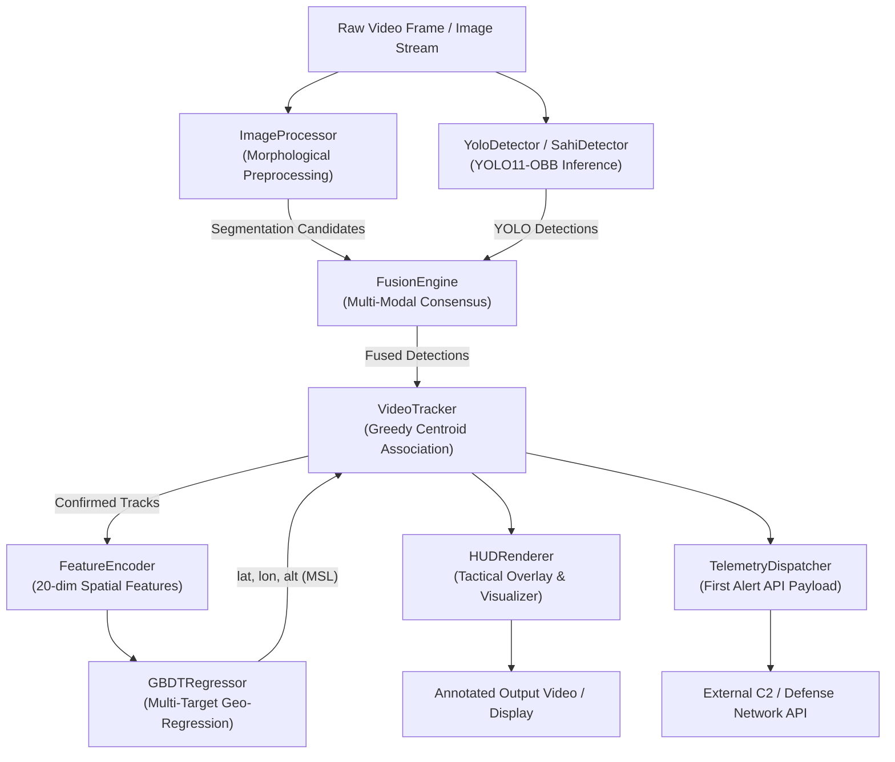

# AI-Based Drone Detection, Localization & Tracking Architecture

This document details the system architecture, component dependencies, and end-to-end data flow for the TESA 2025 Defensive Track pipeline.

---

## 1. System Overview & Data Flow

---

## 2. Module Dependency Graph

```mermaid
graph TD
    subgraph Config & Utilities
        cfg["defense.config"]
        log["defense.utils.logger"]
        geom["defense.utils.geometry"]
        img_io["defense.utils.image_io"]
        vid_io["defense.utils.video_io"]
    end

    subgraph Module 1: Detection
        proc["ImageProcessor"]
        yolo["YoloDetector"]
        sahi["SahiDetector"]
        tune["tune_confidence"]
    end

    subgraph Module 2: Localization
        feat["encode_features"]
        gbdt["GBDTRegressor"]
        fuse["FusionEngine"]
        eval["evaluate_localization"]
    end

    subgraph Module 3: Tracking
        track["DroneTrack"]
        vtrack["VideoTracker"]
        hud["HUDRenderer"]
        tel["TelemetryDispatcher"]
    end

    subgraph CLI Scripts
        s_det["scripts/detect_images.py"]
        s_loc["scripts/localize_drones.py"]
        s_trk["scripts/track_video.py"]
        s_trn["scripts/train_gbdt.py"]
        s_tne["scripts/tune_confidence.py"]
        s_dat["scripts/prepare_dataset.py"]
        s_sub["scripts/generate_submission.py"]
    end

    cfg --> log
    proc --> log
    yolo --> log
    sahi --> log
    tune --> log
    feat --> log
    gbdt --> log
    fuse --> log
    eval --> geom
    eval --> log
    track --> log
    vtrack --> track
    vtrack --> feat
    vtrack --> log
    hud --> track
    tel --> log

    s_trk --> vtrack
    s_trk --> hud
    s_trk --> tel
    s_trk --> yolo
    s_trk --> gbdt
    s_trk --> proc
    s_trk --> fuse
    s_trk --> vid_io
```

---

## 3. Detailed Component Breakdown

### 1. Detection Layer (`defense/detection/`)
- **`ImageProcessor`**: Classical morphological pipeline. Converts frames to grayscale, binarizes (inverting pixel intensities), dilates with a rectangular kernel ($50 \times 50$) to bridge airframe and propeller fragments, applies morphological closing ($5 \times 5$), filters contours by area, and suppresses background clutter.
- **`YoloDetector`**: Wraps YOLO11-OBB (Oriented Bounding Boxes) and standard bounding box inference. Retains rotated bounding polygon coordinates for close-proximity separation of multi-drone swarms.
- **`SahiDetector`**: Slicing Aided Hyper Inference. Slices full-resolution image inputs (e.g. 4K/1080p) into $640 \times 640$ overlapping tiles (25% overlap) and merges candidates with NMS to preserve small, distant targets.
- **`confidence_tuner`**: Automated parameter sweep utility to compute precision, recall, RMSE, and exact count match accuracy across detection thresholds.

### 2. Localization Layer (`defense/localization/`)
- **`feature_encoder`**: Transforms 2D bounding boxes into a standardized 20-dimensional spatial feature vector capturing optical coordinates, normalized image ratios, radial distance, polar angle, quadrant indices, 4-corner distances, polynomial terms ($nx^2, ny^2, nx \cdot ny$), and trigonometric projections ($\sin\theta, \cos\theta$).
- **`GBDTRegressor`**: Three independent Gradient Boosting Regressors for latitude, longitude, and altitude above sea level, fitted with standard scaling.
- **`FusionEngine`**: Integrates deep learning and segmentation candidates using multi-modal scoring (IoU, physical shape plausibility, and motion continuity) across 6 operational modes (`adaptive`, `filter`, `soft`, `hard`, `yolo`, `seg`).
- **`evaluation`**: Calculates geodesic Haversine distance errors, azimuth bearing discrepancies, and altitude deviations weighted by competition metric:
  $$\text{Score} = 0.70 \cdot \overline{\Delta\theta} + 0.15 \cdot \overline{\Delta h} + 0.15 \cdot \overline{\Delta r}$$

### 3. Tracking Layer (`defense/tracking/`)
- **`DroneTrack`**: Stateful tracker encapsulating track ID, 10-color cyclical palette, bounding box history, confidence, 3D coordinates, consecutive confirmation counter (default 3 frames), and lost frame memory (default 30 frames).
- **`VideoTracker`**: Greedy nearest-centroid association with Euclidean distance gating. Manages track creation, confirmation, updates, lost state, and pruning.
- **`HUDRenderer`**: Renders real-time visual telemetry overlay with global status bar, bounding boxes, centroid dots, auto-positioning telemetry cards (ID, confidence, lat, lon, alt), and track badges.
- **`TelemetryDispatcher`**: Builds standardized JSON alert payloads containing timestamp, station coordinates, detected objects, and Base64-encoded frame images for immediate C2 dispatch upon first confirmed detection.
